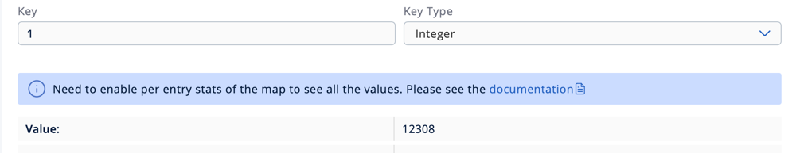
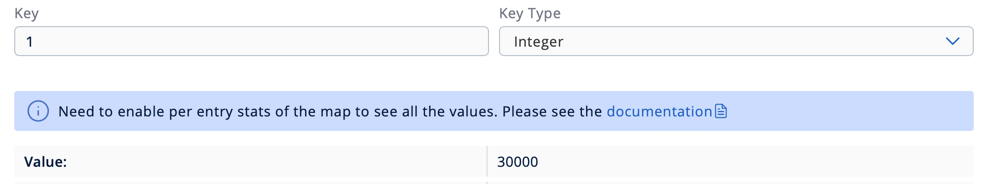
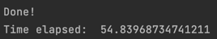
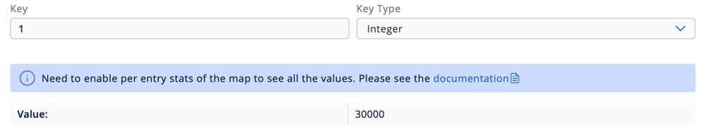
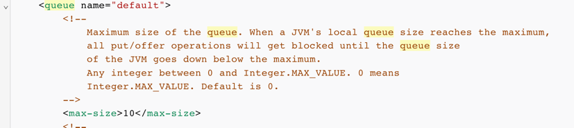
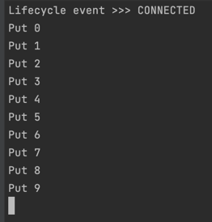
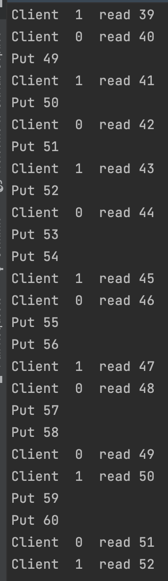

# software_architecture_task2

## 1. Lunch cluster with 3 nodes:

Lunch cluster
```bash
docker run \
    --name node-1 --rm \                            
    -e HZ_NETWORK_PUBLICADDRESS=<host_ip>:5701 \
    -e HZ_CLUSTERNAME=hazelcast-cluster \
    -p 5701:5701 hazelcast/hazelcast:5.0
```

Lunch second and third nodes
```bash
docker run \
    -it \
    --name node-2 --rm \                            
    -e HZ_NETWORK_PUBLICADDRESS=10.10.224.73:5702 \
    -e HZ_CLUSTERNAME=hazelcast-cluster \
    -p 5702:5701 hazelcast/hazelcast:5.0
```

```bash
docker run \
    -it \
    --name node-3 --rm \                    
    -e HZ_NETWORK_PUBLICADDRESS=10.10.224.73:5703 \
    -e HZ_CLUSTERNAME=hazelcast-cluster \
    -p 5703:5701 hazelcast/hazelcast:5.0 
```

## 2. Connect to the cluster and put data in Distributed Map via python client

Code presented in the file `hazelcast_client_1.py`

Result of the code execution from the hazelcast management center:


Shutting down the node-3:


Shutting down the node-2:


We can see that the data is still available in the cluster. It's because the data is distributed across the cluster nodes.
But if we shut down the node-1 simultaneously with the node-3, the data will be lost, due to the fact that the data is not replicated across the nodes.

There are several ways to solve this problem:
- Don't shut down the nodes simultaneously
- Increase the number of nodes in the cluster

## 3. Work with Distributed Map with locks via 3 clients

Clients code presented in the file `hazelcast_client_2.py`

Result of the code execution from the hazelcast management center:



We can see that when process can't capture the value from the map, his incrementation is not executed.
Next, try another approach with pessimistic lock:

Clients code presented in the file `hazelcast_client_pessimistic.py`

Result of the code execution from the hazelcast management center:


Time taken:<br>


Next, try another approach with optimistic lock:

Clients code presented in the file `hazelcast_client_optimistic.py`

Result of the code execution from the hazelcast management center:


Time taken:<br>


We can see that the optimistic lock is the fastest. And both pessimistic and optimistic locks are working correctly, without any data loss.

## 4. Work with Bounded Queue via 3 clients

Configuring the queue:<br>
In order to configure the queue, we need to change the following lines in the hazelcast configuration file:<br>




Then everything is needed it to restart the cluster.<br>
Clients code presented in the file `hazelcast_client_bounded_queue.py`

When the queue is full, and nobody is trying to read from it, the process will be blocked until the queue is not full anymore.


Running read and write processes simultaneously shows that the queue is working correctly.<br>



We can observe that clients read sequentially from the queue, and the queue is working correctly.